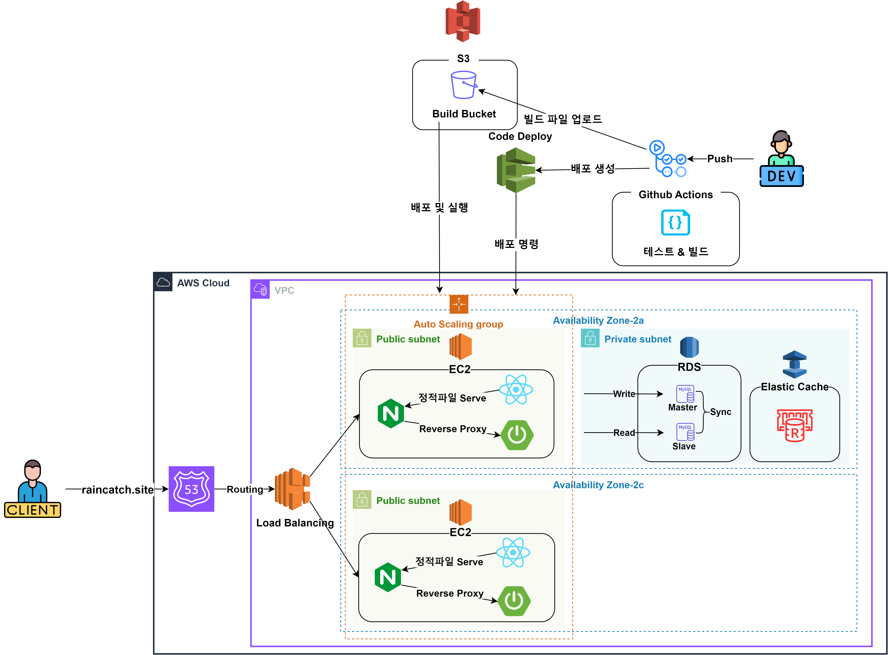
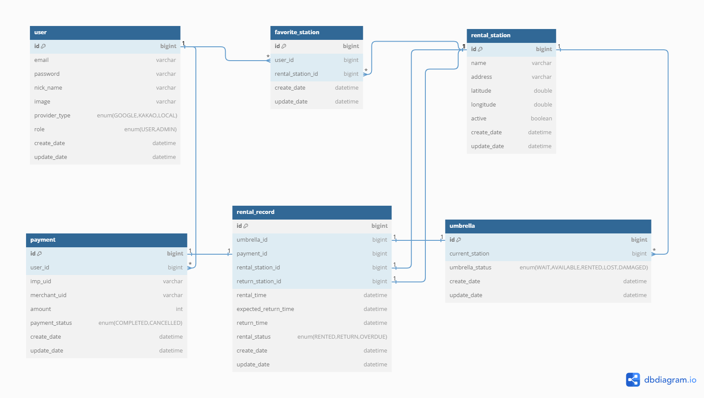

# [RainCatch] 공유 우산 플랫폼

```text
☔ 비오는 날 우산이 없을 때, 누구나 이용할 수 있는 공유 우산 서비스입니다.
```

- [ 🎯 서비스 배경 및 목표]
- [ 🛠️ 기술 스택]
- [ 📀 아키텍처]
- [ 📂 패키지 구조]
- [ 🚀 기술적 경험]

---
## 🎯 서비스 배경 및 목표
비가 예상치 않게 내릴 때 일회용 우산을 구매하는 일이 빈번하게 발생합니다.<br/>
이는 매년 전 세계적으로 25개의 에펠탑을 쌓을 만큼의 양을 소각하는 결과를 낳고, 우산 폐기물로 인한 환경 파괴로 이어집니다.<br/>


>해당 프로젝트는 **2020 환경보전 및 에너지 절감 대국민 아이디어 공모전** 2등 우수상을 수상한 우산 공유 시스템 MVP모델을 
개인적으로 고도화 하는 프로젝트입니다.

서비스 목표는 다음과 같습니다.
- 우산을 쉽게 빌리고 반납할 수 있도록 하여 일회용 우산 폐기를 줄이고 환경 보호에 기여합니다.
- 위치 기반 서비스를 통해 가까운 우산 대여소를 쉽게 찾을 수 있으며, 사용 가능한 우산의 수를 확인할 수 있습니다.
- 서버 이중화, 로드 밸런싱, CI/CD 자동화를 통한 안정적인 서비스 운영을 목표로 합니다.

## 🛠️ 기술 스택
| 분류       | 기술 명                                                                    |
|----------|-------------------------------------------------------------------------|
| BackEnd  | Java, Spring(Boot,Security,JPA), QueryDsl, JUnit, Mockito, Redis, MySQL |
| FrontEnd | JavaScript, axios, React(도입 중)                                          |
| DevOps   | NGINX,(AWS) EC2, RDS, ELB, CodeDeploy, GithubActions                    |
| Tools    | nGrinder, JMeter, Scouter, IntelliJ, Gradle                             |

## 📀 아키텍처


## 🗃️ ERD


## 📂 패키지 구조

## 🚀 기술적 경험
### GithubActions와 CodeDeploy를 사용한 CI/CD 자동화 파이프라인 구축

### JWT기반 인증구조 구현

### 하버사인 공식을 이용한 위치기반 주변 데이터 검색

### CircuitBreaker 패턴을 통한 외부 API 장애상황 대비

### AutoScaling과 LoadBalancer를 이용한 서버 이중화 및 부하분산
