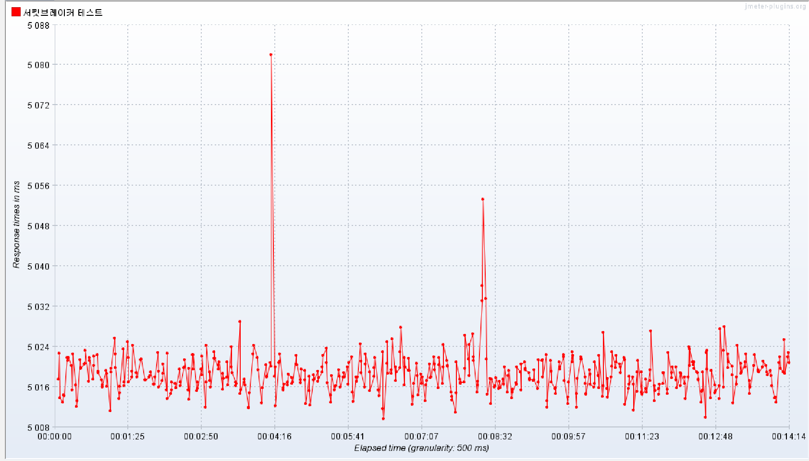
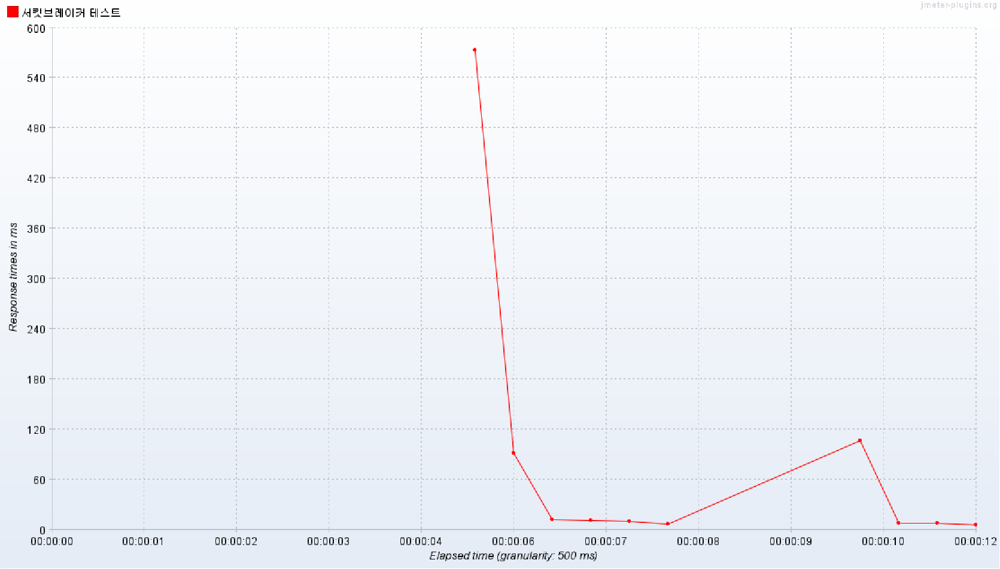

# [RainCatch] 공유 우산 플랫폼

```text
☔ 비오는 날 우산이 없을 때, 누구나 이용할 수 있는 공유 우산 서비스입니다.
```

- [ 🎯 서비스 배경 및 목표](#-서비스-배경-및-목표)
- [ 🛠️ 기술 스택](#-기술-스택)
- [ 📀 아키텍처](#-아키텍처)
- [ 📂 패키지 구조](#-패키지-구조)
- [ 🚀 기술적 경험](#-기술적-경험)

---
## 🎯 서비스 배경 및 목표
>해당 프로젝트는 **2020 환경보전 및 에너지 절감 대국민 아이디어 공모전** 2등 우수상을 수상한 우산 공유 시스템 MVP모델을 
개인적으로 고도화한 프로젝트입니다.

갑작스러운 우천시, 많은 사람들이 일회용 우산을 구매합니다.<br/>
그러나 이 우산들은 사용 후 쉽게 잃어버리거나 버려지는 경우가 많습니다.<br/>
그 결과 매년 전 세계적으로 25개의 에펠탑을 쌓을 만큼 소각하게되어 환경파괴를 일으키고 있습니다.<br/>
이를 방지하고자 우산을 쉽게 빌리고 반납할 수 있는 공유 우산 서비스를 기획하였습니다.<br/>

서비스 목표는 다음과 같습니다.
- 우산을 쉽게 빌리고 반납할 수 있도록 하여 일회용 우산 폐기를 줄이고 환경 보호에 기여합니다.
- 위치 기반 서비스를 통해 가까운 우산 대여소를 쉽게 찾을 수 있으며, 사용 가능한 우산의 수를 확인할 수 있습니다.
- 서버 이중화, 로드 밸런싱, CI/CD 자동화를 통한 안정적인 서비스 운영을 목표로 합니다.

## 🛠️ 기술 스택
| 분류       | 기술 명                                                                    |
|----------|-------------------------------------------------------------------------|
| BackEnd  | Java, Spring(Boot,Security,JPA), QueryDsl, JUnit, Mockito, Redis, MySQL |
| FrontEnd | JavaScript, axios, React(도입 중)                                          |
| DevOps   | NGINX, (AWS) EC2, RDS, ELB, CodeDeploy, GithubActions                   |
| Tools    | nGrinder, JMeter, Scouter, IntelliJ, Gradle                             |

## 📀 아키텍처


## 🗃️ ERD


## 📂 패키지 구조
```text
RainCatch
    ├─.github
    │    └─workflows
    │
    ├─frontend
    │     ├─build/...
    │     ├─public/...
    │     └─src
    │        ├─components/...
    │        └─modules/...
    │
    ├─backend
    │    └─src
    │       ├─main/java/oo/kr/shared
    │       │             ├─domain
    │       │             │    └─api
    │       │             │       ├─controller
    │       │             │       │     ├─request
    │       │             │       │     └─response
    │       │             │       ├─domain
    │       │             │       │     ├─entity
    │       │             │       │     └─repository
    │       │             │       └─service
    │       │             │
    │       │             └─global
    │       │                 ├─config
    │       │                 ├─exception
    │       │                 ├─security
    │       │                 ├─utils
    │       │                 └─ ...
    │       └─test/...
    └─README.md
```
## 🚀 기술적 경험
### GithubActions와 CodeDeploy를 사용한 CI/CD 자동화 파이프라인 구축 [[구성패키지](https://github.com/kihong1602/Rain-Catch/tree/main/.github/workflows)]
- build 작업은 pull-request, push 이벤트 시 반복 사용되고, deploy 작업은 frontend, backend push 작업에 반복 사용
- 중복 코드를 줄이고 재사용성을 높이기위해 GithubActions의 Reusable Workflow로 build, deploy 작업 분리

### JWT기반 인증구조 구현[[구현코드](https://github.com/kihong1602/Rain-Catch/blob/d357ecfcaa5f09e179eca118d708aa42b9761d57/backend/src/main/java/oo/kr/shared/global/security/filter/JwtAuthenticationFilter.java#L27-L95) / [구성패키지](https://github.com/kihong1602/Rain-Catch/tree/main/backend/src/main/java/oo/kr/shared/global/security/jwt)]
- 세션기반 인증구조는 트래픽이 커질수록 서버 부하가 증가
- 토큰기반 인증구조를 도입해 인가 요청에 대한 서버 부하 감소
- 토큰 탈취를 대비해 AccessToken 만료시간을 짧게 설정
  - ReFreshToken을 사용해 AccessToken을 갱신하도록 구성

### 하버사인 공식을 이용한 위치기반 주변 데이터 검색[[구현코드](https://github.com/kihong1602/Rain-Catch/blob/c504f3ee1474b2285a71da4572fbe57c56a9701b/backend/src/main/java/oo/kr/shared/domain/rentalstation/domain/repository/custom/QRentalStationRepositoryImpl.java#L29-L61)]
- 프로젝트 초기, MySQL 네이티브 쿼리를 이용해 주변 데이터 검색 로직 구현
  - MySQL에 의존하는 쿼리문으로 인해 DB 변경에 제약사항이 존재
- 하버사인공식을 직접 QueryDSL로 구현해 DB 변경이나 테스트환경에서도 유연하게 작동하도록 구현

### CircuitBreaker 패턴을 통한 외부 API 장애상황 대비[[구현코드1](https://github.com/kihong1602/Rain-Catch/blob/f9a2534c02407f0db29d9d35686998b9c00938d4/backend/src/main/java/oo/kr/shared/global/portone/PaymentClient.java#L26) / [구현코드2](https://github.com/kihong1602/Rain-Catch/blob/f9a2534c02407f0db29d9d35686998b9c00938d4/backend/src/main/java/oo/kr/shared/global/exception/handler/GlobalExceptionHandler.java#L31-L36) / [설정코드](https://github.com/kihong1602/Rain-Catch/blob/f9a2534c02407f0db29d9d35686998b9c00938d4/backend/src/main/resources/application.yml#L46-L65)]
- 외부 API 서버 장애발생시 Timeout을 기다림으로 불필요한 자원낭비
- 서킷브레이커 패턴을 도입해 일정 횟수 이상 에러가 감지된다면 서킷을 열어 빠른 에러 응답
<details>
<summary>5100건의 요청에 대해 에러 응답시간 대폭 향상</summary>
<p>서킷브레이커 적용 전 14분14초, 서킷브레이커 적용 후 12초</p>


</details>

### AutoScaling과 LoadBalancer를 이용한 서버 이중화 및 부하분산
- 단일 서버 구조는 트래픽 증가시 서비스 중단의 위험 존재
- AutoScaling Group을 설정하여 CPU 사용량 70%이상일 경우 인스턴스를 생성하도록 구성
- LoadBalancer ELB를 통해 클라이언트 요청을 서버에 안정적으로 부하 분산